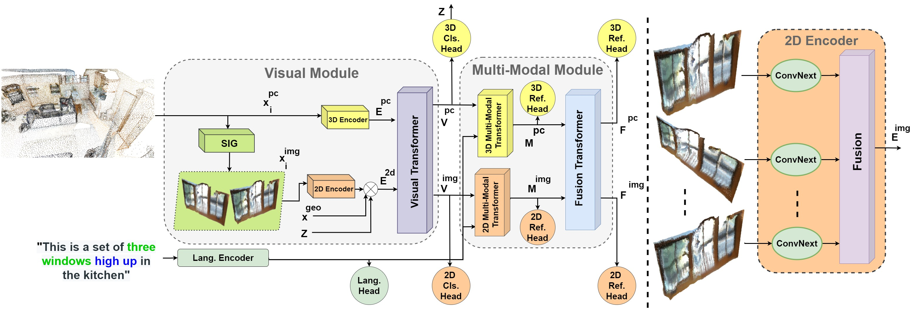
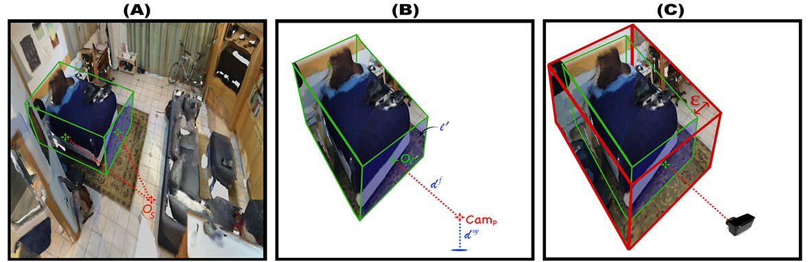

# LAR-Look-Around-and-Refer
This is the official implementation for our paper;"LAR:Look Around and Refer".

## Awesome Features in the code
* Support distributed training.
* Our projection codes can be adapted easily and extended to other applications, where the codes do not rely on any 3D library (e.g. [open3D](http://www.open3d.org/docs/release/introduction.html))
* We adopted a [fully pytorch implementation for P++](https://github.com/yanx27/Pointnet_Pointnet2_pytorch) instead of cuda implementation.


## Introduction
3D visual grounding task has been explored with visual and language streams to comprehend referential language for identifying targeted objects in 3D scenes.
However, most existing methods devote the visual stream to capture the 3D visual clues using off-the-shelf point clouds encoders.
The main question we address is can we consolidate the 3D visual stream by 2D clues and efficiently utilize them in both training and testing phases?.
The main idea is to assist the 3D encoder by incorporating rich 2D object representations without requiring extra 2D inputs.
To this end, we leverage 2D clues, synthetically generated from 3D point clouds, that empirically show their aptitude to boost the quality of the learned visual representations. 
We validate our approach through comprehensive experiments on Nr3D, Sr3D, and ScanRefer datasets.
Our experiments show consistent performance gains against counterparts, where our proposed module, dubbed as LAR, significantly outperforms state-of-the-art 3D visual grounding techniques on three benchmarks.
Our code will be made publicly available. 
<p align="center">
  
</p>

## Architecture
Detailed overview of LAR. The Visual Module incorporates rich 3D representation from the extracted 3D object points with the 2D synthetic image features using Visual Transformer. The 2D synthetic images are first extracted by SIG then processed by a shared ConvNext backbone. Simultaneously, language descriptions are transformed into tokens and embedded into a feature vector. Then, the Multi-Modal Module fuses the output of the Visual Module separately by two Transformers. Finally, the output of the Multi-Modal Transformers is processed by a Fusion Transformers.
<p align="center">
  
</p>


## Prerequisites
* Python >= 3.5
* Pytorch >= 1.7.0
* Install other common packages (numpy, [pytorch_transformers](https://pypi.org/project/pytorch-transformers/), etc.)
* Please refer to ``setup.py`` (From [ReferIt3D](https://github.com/referit3d/referit3d)).


## Data
### ScanNet
First you should download the train/val scans of ScanNet if you do not have them locally. Please refer to the [instructions from referit3d](referit3d/data/scannet/README.md) for more details. The output is the ``scanfile`` ``keep_all_points_00_view_with_global_scan_alignment.pkl/keep_all_points_with_global_scan_alignment.pkl``.

### Ref3D Linguistic Data
You can dowload the Nr3D and Sr3D/Sr3D+ from [Referit3D](https://github.com/referit3d/referit3d#our-linguistic-data), and send the file path to ``referit3D-file``.

### LAR Synthetic 2D Features
You can generate the synthetic data once and save it to save training time. [Projection codes](referit3d/in_out/three_d_object.py)
<p align="center">
  
</p>
Simplified overview of our 2D Synthetic Images Generator (SIG) module. First, we determine the prominent face for each object w.r.t the scene center. Then, the camera is located at a distance $d^f$ from that face, and at distance $d^{up}$ from the room’s floor. Finally, we randomly extend the region of interest by $\epsilon$.
<p align="center">
  
</p>

## Training
Please reference the following example command on Nr3D. Feel free to change the parameters. Please reference [arguments](referit3d/in_out/arguments.py) for valid options.
  ```
  scanfile=keep_all_points_00_view_with_global_scan_alignment.pkl ## keep_all_points_with_global_scan_alignment if include Sr3D
  python train_referit3d.py --patience 100 --max-train-epochs 100 --init-lr 1e-4 --batch-size 16 --transformer --model mmt_referIt3DNet -scannet-file $scanfile -referit3D-file $nr3dfile_csv --log-dir log/$exp_id --n-workers 2 --gpu 0 --unit-sphere-norm True --feat2d clsvecROI --context_2d unaligned --mmt_mask train2d --warmup
  ```

## Evaluation
Please find the pretrained models [here](https://drive.google.com/drive/folders/14VZQHu38mZ0aoLbBAXM-_LHCMgBktH_Q?usp=sharing) (clsvecROI on Nr3D).
A known issue [here](https://github.com/zyang-ur/SAT/blob/main/referit3d/scripts/train_referit3d.py#L12).
  ```
  python train_referit3d.py --transformer --model mmt_referIt3DNet -scannet-file $scanfile -referit3D-file $nr3dfile --log-dir log/$exp_id --n-workers 2 --gpu $gpu --unit-sphere-norm True --feat2d clsvecROI --mode evaluate --pretrain-path $pretrain_path/best_model.pth
  ```

## Credits
The project is built based on the following repository:
* [ReferIt3D](https://github.com/referit3d/referit3d).
* [P++](https://github.com/yanx27/Pointnet_Pointnet2_pytorch)

Part of the code or models are from [ScanRef](https://github.com/daveredrum/ScanRefer), [MMF](https://github.com/facebookresearch/mmf), [TAP](https://github.com/microsoft/TAP), and [ViLBERT](https://github.com/jiasenlu/vilbert_beta).
